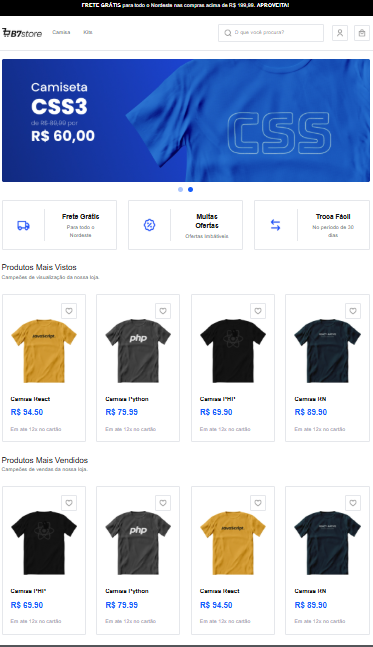
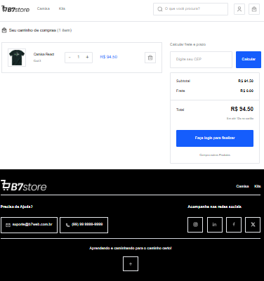
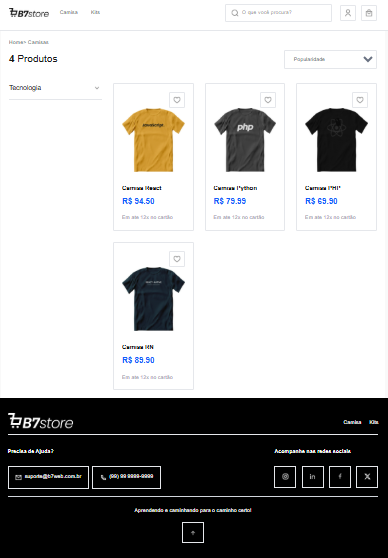
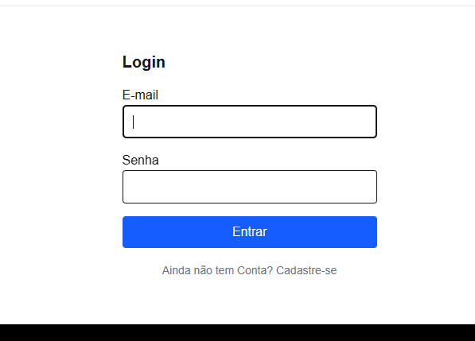
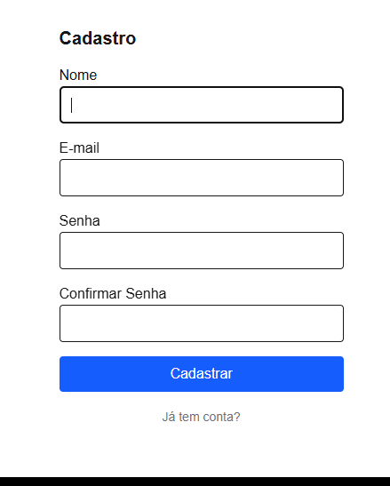

#  B7Store


Loja virtual de camisas geek, com marcas inspiradas em **linguagens de programação**.  
Desenvolvida com **React**, **Next.js**, **TailwindCSS** e **TypeScript**, utilizando **PostgreSQL** + **Prisma** para persistência e **Stripe** para pagamentos.

O projeto foi criado como parte dos estudos na [B7Web](https://app.b7web.com.br), com foco em boas práticas de desenvolvimento moderno e integração de serviços externos.


---

##  Tecnologias Utilizadas

- **[React](ca://s?q=O_que_eh_React)** – Biblioteca para interfaces dinâmicas.
- **[Next.js](ca://s?q=O_que_eh_Next.js)** – Framework para SSR/SSG.
- **[TailwindCSS](ca://s?q=O_que_eh_TailwindCSS)** – Estilização rápida e responsiva.
- **[TypeScript](ca://s?q=O_que_eh_TypeScript)** – Tipagem estática para maior segurança.
- **[PostgreSQL](ca://s?q=O_que_eh_PostgreSQL)** – Banco de dados relacional.
- **[Prisma](ca://s?q=O_que_eh_Prisma)** – ORM para integração com o banco.
- **[Stripe](ca://s?q=Como_funciona_o_Stripe)** – Pagamentos online.

---

## Funcionalidades

# 🛒 B7Store


Loja virtual de camisas geek, com marcas inspiradas em **linguagens de programação**.  
Desenvolvida com **React**, **Next.js**, **TailwindCSS** e **TypeScript**, utilizando **PostgreSQL** + **Prisma** para persistência e **Stripe** para pagamentos.

---

## 🚀 Tecnologias Utilizadas

- **[React](ca://s?q=O_que_eh_React)** – Biblioteca para interfaces dinâmicas.
- **[Next.js](ca://s?q=O_que_eh_Next.js)** – Framework para SSR/SSG.
- **[TailwindCSS](ca://s?q=O_que_eh_TailwindCSS)** – Estilização rápida e responsiva.
- **[TypeScript](ca://s?q=O_que_eh_TypeScript)** – Tipagem estática para maior segurança.
- **[PostgreSQL](ca://s?q=O_que_eh_PostgreSQL)** – Banco de dados relacional.
- **[Prisma](ca://s?q=O_que_eh_Prisma)** – ORM para integração com o banco.
- **[Stripe](ca://s?q=Como_funciona_o_Stripe)** – Pagamentos online.

---

## 🖼️ Funcionalidades

### Tela Principal
Layout inspirado em e-commerces modernos, com listagem de produtos.


---

### Carrinho de Compras
Adiciona/remover produtos e calcula frete via CEP.


---

### Filtros por Marca
Marcas representadas por linguagens de programação (JavaScript, Python, Go, etc).


---


### Autenticação (Login e Cadastro)
Sistema de login e cadastro integrado ao banco de dados com **Prisma** e **PostgreSQL**.



---

---

## Instalação

1. Clone o repositório:
   ```bash
   git clone https://github.com/H-Codd/b7store-frontend
   cd b7store-frontend 
   git clone https://github.com/suporteb7web/b7store-backend

2. Para especificação do projeto vai para [backend](https://github.com/suporteb7web/b7store-backend) contém instruções para instalar e modificar o backend
